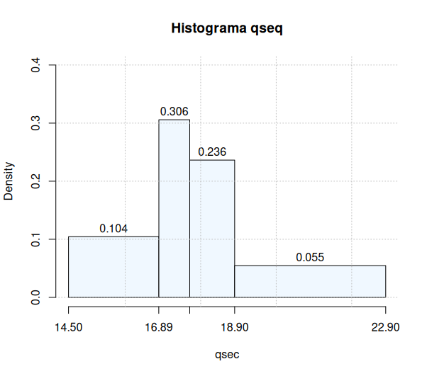

# Lista 1

Data: 2023-12-03 15:58
Last Modified: `=dateformat(this.file.mtime, "yyyy-MM-dd - HH:mm")`

---

## Questão A

> [!NOTE]
> Com a coluna mpg que consta na base, calcular: mínimo e o máximo valor, média, mediana, desvio padrão, os quartis, construir o histograma e o boxplot e interpretar os resultados.

```R
# Ler os dados
setwd("/home/arthurpmrs/ufal/cc/materias/periodo_3/estatistica/listas")
data = read.csv("mtcars.csv", sep=";", header=TRUE, dec=",")
print(data)
mpg = data$mpg

# Estatísticas da coluna
result = data.frame(
  Propriedades = c("Max", "Min", "Média", "Mediana", "Desvio Padrão", "Q1", "Q3"),
  Valores = c(max(mpg), min(mpg), mean(mpg), median(mpg), sd(mpg), quantile(mpg, 0.25),
              quantile(mpg, 0.75))
)
print(result)

# Cálculo das classes
amp = (max(mpg) - min(mpg))
n_classes = (round(1 + 3.322 * log10(length(mpg)), digits=0))
amp_classes = round(amp / n_classes, digits=0)
classes = seq(floor(min(mpg)), ceiling(max(mpg)), amp_classes)

# Geração do Histograma
h = hist(mpg, breaks=classes, axes=FALSE, labels=TRUE, ylim=c(0, 14),
     xlab = "MPG", main="Histograma - MPG")

# Customizar os ticks do histograma
axis(side = 1, at = classes)
axis(side = 2)
grid(col = "gray", lty = "dotted")

# Geração do boxplot
boxplot(mpg, main="Boxplot - MPG")
grid(col = "gray", lty = "dotted")

# Resulk
   Propriedades   Valores
1           Max 33.900000
2           Min 10.400000
3         Média 20.090625
4       Mediana 19.200000
5 Desvio Padrão  6.026948
6            Q1 15.425000
7            Q3 22.800000
```


A coluna MPG representa uma medida de eficiência energética dos carros, milhas por galão, ou de forma equivalente no SI, km/L. Quanto maior é esse valor, menos combustível ele consome.

A partir dos resultados, é possível perceber que a maioria dos carros apresenta eficiência entre 14 e 22 mpg, o que é de se esperar, já que para obter uma alta eficiência, é necessário usar peças e tecnologias mais caras, ou sacrificar a potência do veículo. Portanto, geralmente, busca-se um compromisso entre custo, potência e eficiência.

A partir do gráfico boxplot, podemos ver com clareza que alguns carros possuem eficiência muito maior que outros. Possivelmente, carros desenvolvidos com foco nessa característica. Nesse conjunto não foram identificados outliers.

## Questão B

> [!NOTE]
> Gerar um gráfico boxplot com as colunas disp e hp.

```r
# Ler os dados
setwd("/home/arthurpmrs/ufal/cc/materias/periodo_3/estatistica/listas")
data = read.csv("mtcars.csv", sep=";", header=TRUE, dec=",")

# Juntar as duas colunas em uma nova tabela
plot_data = cbind(disp=data$disp, hp=data$hp)

# Plot
bp = boxplot(plot_data, col=c("lightblue", "lightgreen"),
             main="Disp and Hp")
grid(col = "gray", lty = "dotted")
```


## Questão C

> [!NOTE]
> Com a coluna qsec, agrupe os dados em seus respectivos quartis, construir tabela com as frequências absolutas e relativas e suas respectivas acumuladas. Gerar o histograma e comentar o resultado obtido.

```r
# Retorna tabela de frequência com amplitude e densidade. Requer classes.
get_freq_table = function(df, classes, labels) {
  freq = table(cut(df, breaks=classes, labels=labels, right=FALSE))
  freq_ac = cumsum(freq)
  freq_rel = prop.table(freq)
  freq_rel_rounded = round(freq_rel, digits=2)
  freq_ac_rel = prop.table(freq_ac)
  freq_ac_rel_rounded = round(freq_ac_rel, digits=2)


  amp_classes = diff(classes)
  density = round(freq_rel / amp_classes, digits=4)

  freq_table = cbind(f=freq, fac=freq_ac, fr=freq_rel_rounded,
                     frac=freq_ac_rel_rounded,
                     A=amp_classes, densidade=density)

  return(as.data.frame(freq_table))
}

# Ler os dados
setwd("/home/arthurpmrs/ufal/cc/materias/periodo_3/estatistica/listas")
data = read.csv("mtcars.csv", sep=";", header=TRUE, dec=",")

# Tabela de frequência
qsec = data$qsec
classes = quantile(qsec)
qsec_ft = get_freq_table(qsec, classes, NULL)
print(qsec_ft)

# Histograma
qsec_h = hist(qsec, breaks=classes, labels=TRUE, axes=FALSE,
              ylim=c(0,0.4), main="Histograma qseq", col="aliceblue")
axis(side = 1, at = round(classes, digits=2))
axis(side = 2)
grid(col = "gray", lty = "dotted")

# Result
            f fac   fr frac      A densidade
[14.5,16.9) 8   8 0.26 0.10 2.3925    0.1079
[16.9,17.7) 8  16 0.26 0.21 0.8175    0.3157
[17.7,18.9) 7  23 0.23 0.29 1.1900    0.1898
[18.9,22.9) 8  31 0.26 0.40 4.0000    0.0645
```



A variável observada representa a quantidade de segundos que um veículo demora para percorrer 1/4 de milha (qsec). A partir do histograma e da tabela de frequências, é possível dizer que a dentro há uma maior concentração de amostras nos intervalos \[16.89, 17.71) e \[17.71, 18.90). Ou seja, os valores observados nesse quartil são mais parecidos. Quanto aos demais, observa-se uma maior dispersão, especialmente nos carros mais lentos.

## Questão D

> [!NOTE]
> Com a coluna hp, gerar um histograma, e elaborar uma tabela de frequência usando as classes sugeridas pelo histograma.

```R
get_freq_table = function(df, classes, labels) {
  freq = table(cut(df, breaks=classes, labels=labels, right=FALSE))
  freq_ac = cumsum(freq)
  freq_rel = prop.table(freq)
  freq_rel_rounded = round(freq_rel, digits=2)
  freq_ac_rel = prop.table(freq_ac)
  freq_ac_rel_rounded = round(freq_ac_rel, digits=2)

  amp_classes = diff(classes)
  density = round(freq_rel / amp_classes, digits=4)

  freq_table = cbind(f=freq, fac=freq_ac, fr=freq_rel_rounded,
                     frac=freq_ac_rel_rounded,
                     A=amp_classes, densidade=density)

  return(as.data.frame(freq_table))
}

# Ler os dados
setwd("/home/arthurpmrs/ufal/cc/materias/periodo_3/estatistica/listas")
data = read.csv("mtcars.csv", sep=";", header=TRUE, dec=",")

hp = data$hp

h = hist(hp, labels=TRUE, col="aliceblue", ylim=c(0, 12), right=FALSE)
print(h$breaks)

r = table(cut(hp, breaks=h$breaks, right=FALSE))

hp_fq= get_freq_table(hp, h$breaks, NULL)
print(hp_fq)

# Result
          f fac   fr frac  A densidade
[50,100)  9   9 0.28 0.06 50    0.0056
[100,150) 8  17 0.25 0.12 50    0.0050
[150,200) 8  25 0.25 0.17 50    0.0050
[200,250) 5  30 0.16 0.21 50    0.0031
[250,300) 1  31 0.03 0.22 50    0.0006
[300,350) 1  32 0.03 0.22 50    0.0006
```


## Questão E

> [!NOTE]
> Com as colunas motor e marcha gerar a matriz com as respectivas frequências, gerar os gráficos de barras motor x marcha e marcha x motor e interpretar os resultados.

```R
# Cria um gráfico de barras com base em duas variáveis qualitativas e uma tabela de frequências.
study_two_variables = function(x, y, title) {
  matrix = table(x, y)

  matrix_rel = round(addmargins(prop.table(matrix)), 2)
  print(matrix_rel)

  bp = barplot(matrix, main=title, col=c("cyan3", "aliceblue"),
               beside=TRUE, legend=TRUE)
}

# Ler os dados
setwd("/home/arthurpmrs/ufal/cc/materias/periodo_3/estatistica/listas")
data = read.csv("mtcars.csv", sep=";", header=TRUE, dec=",")

# Separa variáveis
motor = data$motor
marcha = data$marcha

# Gerar histograma e tabelas
study_two_variables(motor, marcha, "Motor x Marcha")
study_two_variables(marcha, motor, "Marcha x Motor")

# Result
               y
x               Automatico Manual  Sum
  Em forma de V       0.38   0.19 0.56
  Reto                0.22   0.22 0.44
  Sum                 0.59   0.41 1.00
            y
x            Em forma de V Reto  Sum
  Automatico          0.38 0.22 0.59
  Manual              0.19 0.22 0.41
  Sum                 0.56 0.44 1.00
```

Na presente análise, buscou-se relacionar duas variáveis qualitativas, o tipo de marcha e o tipo de motor. A partir das tabelas de frequência, foi possível perceber que a maior parte dos veículos observados possui câmbio automático e tem motor em forma de V, com 38% do total. Já o câmbio manual  com motor em forma de V foi o menos observado, com 19% do total.


A partir dos gráficos, percebe-se que em carros automáticos é mais comum o motor em V. Já nos manuais, é mais comum o motor reto, mas por uma menor margem. Observando na outra ordem, verifica-se que em motores do tipo reto, foram iguais os tipos de câmbio observados. No entanto, em relação ao motor em forma de V, o câmbio automático é muito mais comum.

## Questão F

> [!NOTE]
> Escolher duas variáveis (colunas), sendo uma qualitativa e outra quantitativa, gerar gráficos de barras e interpretar os resultados.

```R
# Ler os dados
setwd("/home/arthurpmrs/ufal/cc/materias/periodo_3/estatistica/listas")
data = read.csv("mtcars.csv", sep=";", header=TRUE, dec=",")

# Seleciona as variáveis
qsec = data$qsec
marcha = data$marcha

# Gerar as classes da variável quantitativa
qsec_classes = quantile(qsec)
qsec_cut = cut(qsec, breaks=qsec_classes, right=FALSE)

# Gerar matrix de frequências
matrix = table(marcha, qsec_cut)
print(matrix)

# Gerar gráfico de barras
bp = barplot(matrix, col=c("azure", "darkslategray1"), beside=TRUE, legend=TRUE,
         main="Marcha vs qsec")
grid(col = "gray", lty = "dotted")

# Result
            qsec_cut
marcha       [14.5,16.9) [16.9,17.7) [17.7,18.9) [18.9,22.9)
  Automatico           3           6           4           5
  Manual               5           2           3           3
```


Ao avaliar as variáveis tipo de câmbio e qsec juntas, percebe-se que em um teste de velocidade em uma pista de 1/4 de milha, carros com câmbio manual mais comumente obtêm os melhores tempos. Entretanto, na faixa superior, \[16.9, 17.7), observa-se que os carros automáticos se saem melhor. Isso pode mostrar que o uso do câmbio automático, apesar de ainda obter resultados impressionantes, pode representar uma perda de desempenho se comparado à troca de marchas manual, nessa situação.

## Questão G

> [!NOTE]
> Escolher duas variáveis (colunas) quantitativas, calcular o coeficiente de correlação, gerar gráfico de dispersão, agrupar usando os quartis e interpretar os resultados.

```R
# Ler os dados
setwd("/home/arthurpmrs/ufal/cc/materias/periodo_3/estatistica/listas")
data = read.csv("mtcars.csv", sep=";", header=TRUE, dec=",")

mpg = data$mpg
wt = data$wt

# Separação nos Quartis
mpg_cut = cut(mpg, breaks=quantile(mpg), right=FALSE)
wt_cut = cut(wt, breaks=quantile(wt), right=FALSE)

matrix = table(mpg_cut, wt_cut)
print(matrix)

# Correlação
R = cor(mpg, wt)
print(R)

plot(mpg, wt,
     main=paste("Miles per Gallon vs Weight R=", as.character(round(R, 4))),
     col="cyan3", lwd=2, pch=21, xlab="Miles per Gallon", ylab="Weight")

abline(lsfit(mpg, wt), col="darkorchid")

# Result
             wt_cut
mpg_cut       [1.51,2.58) [2.58,3.33) [3.33,3.61) [3.61,5.42)
  [10.4,15.4)           0           0           3           4
  [15.4,19.2)           0           1           4           2
  [19.2,22.8)           1           5           1           1
  [22.8,33.9)           6           2           0           0

R = -0.8676594
```


Por meio da análise, vemos que o peso dos veículos e a sua eficiência energética são variáveis inversamente proporcionais, como evidenciado pelo valor do coeficiente de correlação (R) igual a -0.8677. O valor próximo a -1 revela que há uma correlação. Já o fato de ser negativo mostra que são inversamente proporcionais.

## Questão H

> [!NOTE]
> Calcular e mostrar a Matriz de Correlação entre todas as variáveis numéricas, e explicar algumas correlações.

```R
# Ler os dados
setwd("/home/arthurpmrs/ufal/cc/materias/periodo_3/estatistica/listas")
data = read.csv("mtcars.csv", sep=";", header=TRUE, dec=",")

# Criar tabela apenas com variáveis numéricas
num_data = cbind(mpg=data$mpg, cly=data$cyl, disp=data$disp, hp=data$hp,
                 drat=data$drat, wt=data$wt, qsec=data$qsec,
                 gear=data$gear, carb=data$carb)

# Gerar matrix de correlação
cor_data = cor(num_data)

# Printar com valores aproximados a 4 casas decimais
print(signif(cor_data), 4)

# Result
         mpg     cly    disp      hp     drat      wt    qsec    gear     carb
mpg   1.0000 -0.8522 -0.8476 -0.7762  0.68117 -0.8677  0.4187  0.4803 -0.55092
cly  -0.8522  1.0000  0.9020  0.8324 -0.69994  0.7825 -0.5912 -0.4927  0.52699
disp -0.8476  0.9020  1.0000  0.7909 -0.71021  0.8880 -0.4337 -0.5556  0.39498
hp   -0.7762  0.8324  0.7909  1.0000 -0.44876  0.6587 -0.7082 -0.1257  0.74981
drat  0.6812 -0.6999 -0.7102 -0.4488  1.00000 -0.7124  0.0912  0.6996 -0.09079
wt   -0.8677  0.7825  0.8880  0.6587 -0.71244  1.0000 -0.1747 -0.5833  0.42761
qsec  0.4187 -0.5912 -0.4337 -0.7082  0.09120 -0.1747  1.0000 -0.2127 -0.65625
gear  0.4803 -0.4927 -0.5556 -0.1257  0.69961 -0.5833 -0.2127  1.0000  0.27407
carb -0.5509  0.5270  0.3950  0.7498 -0.09079  0.4276 -0.6562  0.2741  1.00000
```

Interpretações

-   **hp vs cly**: De acordo com os dados, a potência do motor é proporcional ao seu número de cilindros, apresentando R=0.8324
-   **cly vs mpg**: Quanto maior o número de cilindros, menor é a eficiência energética do veículo. O valor de coeficiente observado foi de R=-0.8522
-   **gear vs hp**: Não existe correlação entre o número de marchas e a potência do veículo, já que apresentou R=-0.1257
-   **qsec vs wt**: O tempo na pista de ¼ de milha também não apresenta correlação com o peso do veículo, apresentando R=-0.1747
